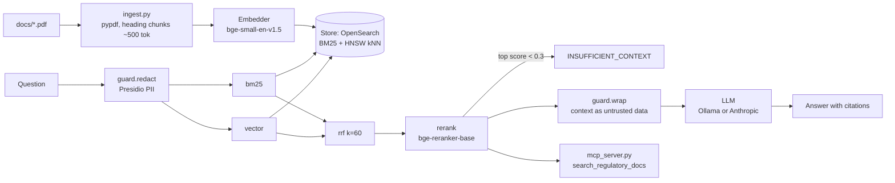
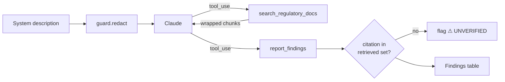

# Regulatory RAG Demo

Local hybrid RAG over public FDA guidance PDFs (Part 11, data integrity, CSA, AI). Answers cite `[doc §section p.page]` for every claim and refuse with `INSUFFICIENT_CONTEXT` when retrieval is weak. Interview demo, not a product.

## Setup

Requires Python 3.11, [uv](https://docs.astral.sh/uv/), Docker, and optionally Ollama and an Anthropic API key.

```bash
docker compose up -d                      # OpenSearch + regdocs index
uv sync
uv run python -m rag.ingest               # parse, chunk, embed, index docs/*.pdf
ollama pull llama3.1:8b                   # if llm: ollama
export ANTHROPIC_API_KEY=...              # if llm: anthropic
uv run python -m rag.generate "What does Part 11 require for audit trails?"
```

`config.yaml` selects `llm` (`ollama` | `anthropic`) and `retrieval` (`vector` | `hybrid` | `hybrid_rerank`).

| Command | What it does |
|---|---|
| `uv run python -m rag.retrieve "q" vector hybrid hybrid_rerank` | Ranked citations per mode |
| `uv run python -m rag.generate "q"` | Cited answer or refusal |
| `uv run python eval/run_eval.py` | Golden-set comparison table |
| `uv run python -m rag.mcp_server` | MCP server (stdio) |
| `uv run python -m rag.agent "system description"` | Compliance gap assessment (Anthropic) |
| `uv run streamlit run app.py` | UI with document library |

## Architecture



- **Retrieval:** BM25 and kNN each return 20 candidates. They're fused with hand-written reciprocal rank fusion, and a cross-encoder reranks the fused list down to the top 5.
- **Refusal:** if the top rerank score is below `min_rerank_score`, the system refuses before calling the LLM.
- **Guard:**
  - PII in queries is redacted before it is logged to `rag.log` or sent anywhere.
  - Retrieved text is wrapped in `<document>` tags, and the system prompt says to treat it as data, not instructions.
  - `docs/zz_poisoned_test.pdf` contains a prompt injection and verifies this.

## Eval

`eval/golden.jsonl` has 30 questions: 25 answerable and 5 that should be refused.

- **Metrics:** recall@5 (expected section in the top 5), citation accuracy (the answer cites the expected section), refusal accuracy, and p50 end-to-end latency.
- **Hardware:** CPU only, no GPU.
- **CI:** `.github/workflows/eval.yml` fails the build if hybrid_rerank recall@5 drops below `baseline_recall_at_5`.

| mode | llm | recall@5 | citation acc | refusal acc | p50 latency |
|---|---|---|---|---|---|
| vector | anthropic | 96% | 84% | 90% | 4.59s |
| hybrid | anthropic | 100% | 88% | 93% | 5.08s |
| hybrid_rerank | anthropic | 100% | 88% | 93% | 23.04s |
| vector | ollama | 96% | 72% | 90% | 51.66s |
| hybrid | ollama | 100% | 72% | 93% | 59.11s |
| hybrid_rerank | ollama | 100% | 72% | 93% | 71.55s |

**Known limitations**
- Two answerable questions are wrongly refused. The right chunk ranks #1, but its rerank score is below 0.3. The threshold is intentionally left untuned because the closest true-refusal question scores 0.061.
- On CPU, reranking 40 candidates takes about 10s per query.
- The heading parser misses data-integrity Q13.
- The AI guidance's `i.` items are labeled `IV.A.4.i`.

## Agent: compliance gap assessor

`rag/agent.py` is a raw Anthropic tool-use loop of about 80 lines, with no agent framework. You give it a description of a system or SOP. It then:

1. Splits the description into separate claims.
2. Calls `search_regulatory_docs` for each claim, refining queries when results are weak.
3. Judges each claim as `compliant`, `gap` or `unclear`, using only the retrieved guidance.
4. Calls `report_findings` with a severity, citations and a remediation for each claim.



- **Bounded loop:** at most 10 turns. The last turn forces a `report_findings` call, so the loop always ends with an answer.
- **Output guardrail:** the code tracks which citations it actually retrieved. Any citation not in that set is flagged, which catches invented references at runtime.
- **Audit trail:** every search query, the citations it returned, and the final findings are written to `rag.log`.
- **Injection:** the agent's audit-trail searches retrieve the poisoned doc, and the agent still reports disabled audit trails as a gap.

Example: `"Our LIMS uses a shared analyst login. Audit trails are off for performance."`

| claim | verdict | severity | citations |
|---|---|---|---|
| Shared analyst login | gap | high | [data_integrity_cgmp_2018 §III.5 p.11] |
| Audit trails off for performance | gap | high | [data_integrity_cgmp_2018 §III.1.c p.8] [part11_scope_2003 §III.C.2 p.9] |

## MCP (Claude Desktop)

`rag/mcp_server.py` exposes one read-only tool, `search_regulatory_docs(query)`. It returns the top hybrid_rerank chunks, and each one includes its citation and rerank score. Add this to `claude_desktop_config.json`:

```json
{
  "mcpServers": {
    "regulatory-docs": {
      "command": "uv",
      "args": ["--directory", "/absolute/path/to/iovance-demo", "run", "python", "-m", "rag.mcp_server"]
    }
  }
}
```

OpenSearch must be running. The first call loads the models and takes a few seconds.

## Swap to AWS (design note)

> **This demo runs entirely locally and uses no AWS services, accounts, or credentials.** This section only sketches how the same design could later move to AWS. Nothing here is implemented.

Each component sits behind a protocol in `rag/interfaces.py`. A move to AWS would mean writing a new implementation of each one, while the retrieval, generation, and guard logic stayed the same.

| Interface / component | Runs today (local) | Possible AWS equivalent (not implemented) |
|---|---|---|
| `Store` | OpenSearch 2.x in Docker | **Amazon OpenSearch Service** (BM25 + kNN in one index; hybrid works unchanged). **S3 Vectors** is a cheaper option for the vector side, but it has no BM25, so hybrid would need OpenSearch anyway. |
| `Embedder` | bge-small-en-v1.5 (384-d) | **Bedrock** Titan Text Embeddings v2 or Cohere Embed. Requires re-indexing with the new dimension. |
| `LLM` | Ollama llama3.1:8b / Anthropic API | **Bedrock** Claude (`AnthropicLLM` → `AnthropicBedrock` client) |
| `rag/agent.py` | Anthropic tool-use loop | **Bedrock** Converse API with the same tool schemas, or a Bedrock Agent with search as an action group (Lambda) |
| `rerank` | bge-reranker-base | **Bedrock** Rerank API (Cohere Rerank / Amazon Rerank) |
| `docs/` | Local folder | **S3** bucket; ingest runs as a Lambda triggered on upload |
| `guard.redact` | Presidio | Presidio in Lambda, or Comprehend PII detection / Bedrock Guardrails |
